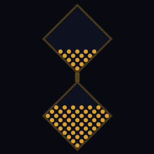

# LED Hourglass

傾きに応じて砂が流れる LED 砂時計タイマー。  
Qt6/C++ 製。Android（加速度センサー）と Windows/Linux（マウス操作）で動作します。



## 機能

- **2チャンバー砂時計** — 上下に並んだ 20×20 LED マトリクス（45°回転ダイヤモンド形）
- **PixelDust 物理** — Adafruit PixelDust を Qt6 に移植した砂粒シミュレーション
- **傾き検知** — Android: 加速度センサー / PC: マウス移動で重力方向をシミュレート
- **設定パネル**（⚙ ボタンから開く）
  - カラー選択（プリセット5色 + 色相スライダー）
  - 計測時間（1分 / 3分 / 5分 / 10分）
  - 砂の量（120 / 200 / 350 粒）
  - 自動ループ（完了後2秒で自動リスタート）
  - センサー感度（0.5x〜2.0x）
- **周回カウント** — 自動ループ時に何回完了したか表示（タップでリセット）
- **スリープ抑止** — タイマー動作中に画面が消えない
- **縦向き固定** — Android で縦向きに固定

## 操作方法

| 操作 | 効果 |
|------|------|
| 下向きに傾ける | 砂が流れ始める |
| ひっくり返す | 逆方向に流れる（タイマーリスタート） |
| ↺ ボタン | 完全リセット |
| ⚙ ボタン（下部） | 設定パネルを開く |
| 周回数タップ | 周回カウントをリセット |

**PC デバッグ:** マウスをウィンドウ下に動かすと砂が落下、上に動かすとひっくり返し。

## ビルド手順

### Windows / Linux (デスクトップ)

```bash
cmake -B build -DCMAKE_BUILD_TYPE=Release -DCMAKE_PREFIX_PATH=/path/to/Qt/6.x.x/msvc2022_64
cmake --build build
```

### Android

```bash
cmake -B build-android \
  -DCMAKE_TOOLCHAIN_FILE=$ANDROID_NDK/build/cmake/android.toolchain.cmake \
  -DANDROID_ABI=arm64-v8a \
  -DANDROID_NDK=$ANDROID_NDK \
  -DANDROID_SDK_ROOT=$ANDROID_SDK_ROOT \
  -DCMAKE_PREFIX_PATH=/path/to/Qt/6.x.x/android_arm64_v8a \
  -DQT_HOST_PATH=/path/to/Qt/6.x.x/gcc_64 \
  -DCMAKE_BUILD_TYPE=Release
cmake --build build-android --target apk
```

### リリース署名

プロジェクトルートに `android-signing.properties` を作成（`.gitignore` 済み）:

```properties
storeFile=/path/to/your.jks
storePassword=yourpassword
keyAlias=youralias
keyPassword=yourpassword
```

## 動作環境

| 項目 | バージョン |
|------|-----------|
| Qt | 6.4 以上 |
| Android NDK | 27.2 |
| Android SDK | API 28〜36 |
| JDK（Android ビルド） | 17 |

## 技術詳細

- **物理エンジン**: [Adafruit PixelDust](https://github.com/adafruit/Adafruit_PixelDust) を Qt6/C++ に移植
  - Arduino/AVR 依存を除去、`QRandomGenerator` 使用
  - 動的粒子数（`addGrain` / `removeGrainAt`）に対応
- **レンダリング**: `QSGGeometryNode`（GPU シーングラフ）で2ダイヤモンドを描画
- **ネック転送**: 重力方向のコーナー付近の粒子を最近傍探索して転送
- **センサー**: 45°回転補正 + 画面回転対応の軸マッピング

## ライセンス

MIT
